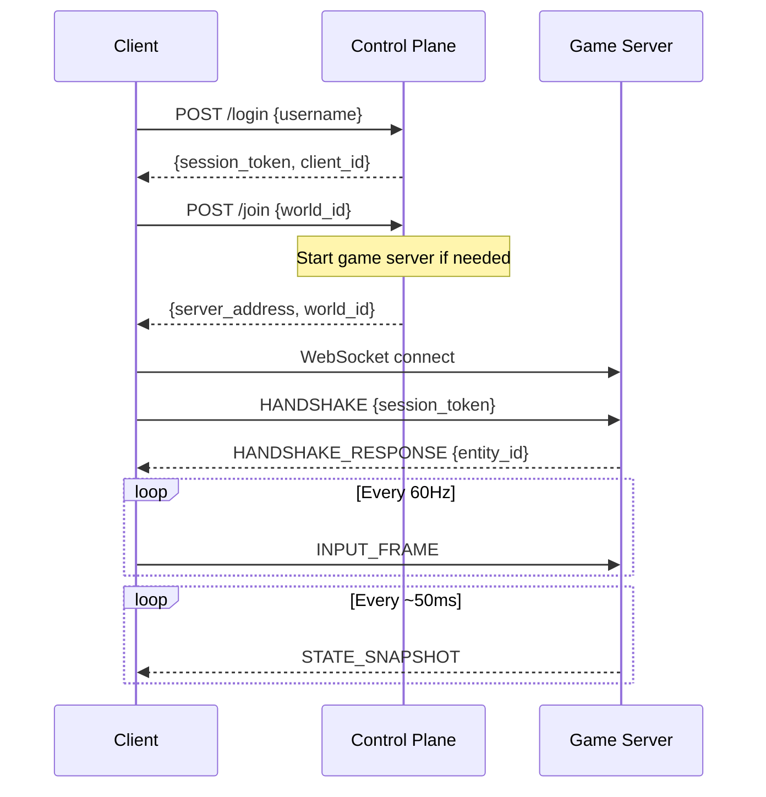

# Server Architecture

This document describes the authoritative server architecture for UGC World.

## Overview

The system uses a two-tier architecture:

```
┌──────────────────────────────────────────────────────────────────────┐
│                         Control Plane (Python)                        │
│  ┌────────────────────────────────────────────────────────────────┐  │
│  │  • Authentication & Session Management                          │  │
│  │  • Matchmaking & Server Assignment                              │  │
│  │  • World Persistence (save/load)                                │  │
│  │  • Game Server Lifecycle Management                             │  │
│  │  • UGC Build Pipeline (stubs)                                   │  │
│  │  • Admin/Debug Endpoints                                        │  │
│  └────────────────────────────────────────────────────────────────┘  │
└──────────────────────────────┬───────────────────────────────────────┘
                               │ spawn/stop servers
                               │ load/save world state
                               ▼
┌──────────────────────────────────────────────────────────────────────┐
│                     Game Server (Godot Headless)                      │
│  ┌────────────────────────────────────────────────────────────────┐  │
│  │  • Fixed timestep simulation (60 Hz)                            │  │
│  │  • Authoritative physics & collision                            │  │
│  │  • Entity management & replication                              │  │
│  │  • Projectile simulation & hit detection                        │  │
│  │  • NPC AI & perception                                          │  │
│  │  • Voxel chunk management                                       │  │
│  └────────────────────────────────────────────────────────────────┘  │
└──────────────────────────────────────────────────────────────────────┘
```

## Component Details

### Control Plane (Python Flask)

**Location:** `server_python/`

The control plane is a REST API server that handles:

#### Authentication & Sessions

```
POST /login
    Request:  { "username": "optional_name" }
    Response: { "session_token": "...", "client_id": "...", "username": "..." }
```

- Simple token-based authentication
- Sessions expire after 4 hours
- No passwords (for now) - just username

#### Matchmaking

```
POST /join
    Headers:  Authorization: Bearer <session_token>
    Request:  { "world_id": "optional_world_id" }
    Response: {
        "server_address": "ws://127.0.0.1:7777",
        "session_token": "...",
        "client_id": "...",
        "world_id": "..."
    }
```

- Creates new world if `world_id` not specified
- Starts game server process if not already running
- Returns WebSocket address for game server

#### World Persistence

```
GET  /world/<world_id>  - Load world state
POST /world/<world_id>  - Save world state
DELETE /world/<world_id> - Delete world
GET  /worlds            - List all worlds
```

#### Spell Build (HTTP fallback for editor/dev clients)

```
POST /api/spells/<spell_id>/build
    Headers: Authorization: Bearer <session_token>
    Request: { "prompt": "", "code": "...", "options": { "metadata": {...} } }
    Response: { "job_id": "...", "spell_id": "..." }

GET  /api/jobs/<job_id>
    Response: { "status": "...", "stage": "...", "progress_pct": 0-100, "result_revision_id": "..." }

POST /api/spells/<spell_id>/publish
    Headers: Authorization: Bearer <session_token>
    Request: { "revision_id": "...", "channel": "beta" }
    Response: { "spell_id": "...", "revision_id": "...", "channel": "beta", "manifest": {...} }

GET  /api/spells/<spell_id>/revisions
GET  /api/spells/<spell_id>/revisions/<revision_id>/manifest
GET  /api/spells/<spell_id>/revisions/<revision_id>/files/<path>
```

World state is stored as JSON files containing:
- Chunk voxel data (compressed)
- Entity positions and states
- Metadata (name, created_at, etc.)

#### Game Server Management

```
GET    /admin/servers       - List running servers
DELETE /admin/servers/<id>  - Stop a server
```

The control plane spawns Godot processes:

```bash
godot --headless --path ./server_godot -- \
    --port 7777 \
    --world world_abc123 \
    --control-plane http://127.0.0.1:5000
```

### Game Server (Godot Headless)

**Location:** `server_godot/`

#### Main Components

```
GameServer (Node)
├── PhysicsWorld (Node3D)
│   └── Player_* (ServerPlayer nodes)
├── ChunkManager (Node)
├── NPCManager (Node)
├── ProjectileManager (Node)
└── EntityRegistry (Autoload)
```

#### Tick Loop

```gdscript
func _physics_process(delta: float) -> void:
    _tick_accumulator += delta
    
    while _tick_accumulator >= TICK_INTERVAL:
        _tick_accumulator -= TICK_INTERVAL
        _simulate_tick()

func _simulate_tick() -> void:
    server_tick += 1
    
    # Process all player inputs
    _process_player_inputs()
    
    # Update projectiles (physics + hit detection)
    _projectile_manager.simulate_tick(server_tick, TICK_INTERVAL)
    
    # Update NPC perception
    _npc_manager.simulate_tick(server_tick, TICK_INTERVAL, entity_registry)
    
    # Broadcast snapshots periodically
    _ticks_since_snapshot += 1
    if _ticks_since_snapshot >= SNAPSHOT_INTERVAL:
        _ticks_since_snapshot = 0
        _broadcast_snapshots()
```

#### Entity Registry

Central tracking of all game entities:

```gdscript
# Register entity and get ID
var entity_id = entity_registry.register_entity(node, Protocol.EntityType.PLAYER)

# Query entities
var players = entity_registry.get_entities_by_type(Protocol.EntityType.PLAYER)
var nearby = entity_registry.get_entities_in_radius(pos, 10.0)
```

#### Client Session Management

Each connected client has a session:

```gdscript
class ClientSession:
    var client_id: int
    var websocket: WebSocketPeer
    var state: State  # CONNECTED, AUTHENTICATED, DISCONNECTED
    var session_token: String
    var entity_id: int
    var last_input_sequence: int
```

### Client (Godot)

**Location:** `client_godot/`

#### Autoloads

```
Protocol       - Message encoding/decoding
GameClient     - Network connection management
EntityManager  - Entity visualization & interpolation
InputBuffer    - Prediction & reconciliation
ChunkCache     - Voxel chunk caching
```

#### Connection Flow



## Data Flow

### Input Processing

1. **Client** gathers input (WASD, mouse, actions)
2. **Client** applies local prediction
3. **Client** sends INPUT_FRAME to server
4. **Server** buffers input by tick
5. **Server** applies input during simulation tick
6. **Server** includes `last_processed_sequence_id` in snapshots
7. **Client** reconciles prediction with server state

### Projectile Authority

1. **Client** sends INPUT_FRAME with `fire: true`
2. **Server** validates fire request
3. **Server** spawns projectile entity
4. **Server** simulates projectile each tick
5. **Server** performs hit detection (raycast/sweep)
6. **Server** broadcasts PROJECTILE_HIT on collision
7. **Client** renders hit effects based on server event

### NPC Perception

1. **Server** runs perception check every N ticks
2. For each NPC, check each player:
   - Distance check (range)
   - Angle check (FOV)
   - Line-of-sight raycast
3. Update suspicion level based on visibility
4. Emit NPC_EVENT on state transitions

### Voxel Terraforming

1. **Client** sends TERRAFORM_REQUEST
2. **Server** validates operation
3. **Server** modifies chunk voxel data
4. **Server** increments chunk versions
5. **Server** broadcasts TERRAFORM_APPLIED
6. **Client** requests updated chunk data
7. **Server** sends CHUNK_DATA

## Scalability Considerations

### Current Limitations

- Single game server per world
- All clients connect to same server
- No sharding or instancing

### Future Improvements

1. **Multiple game servers** per world (sharding by region)
2. **Interest management** - only send nearby entity updates
3. **Load balancing** - distribute players across servers
4. **Horizontal scaling** - multiple control plane instances

## Deployment

### Development

```bash
# Terminal 1: Control Plane
cd server_python
python app.py

# Terminal 2: Game client(s)
cd client_godot
godot --path .
```

### Production

```bash
# Control Plane (fly.io, etc.)
cd server_python
fly deploy

# Game Servers (spawned by control plane)
# Requires Godot headless binary in PATH
```

## Configuration

### Environment Variables

**Control Plane:**
```bash
HOST=0.0.0.0
PORT=5000
SECRET_KEY=your-secret-key
GODOT_PATH=/usr/bin/godot
GAME_SERVER_PATH=../server_godot
```

**Game Server (command line):**
```bash
--port 7777
--world world_abc123
--control-plane http://127.0.0.1:5000
```

## Monitoring

### Health Checks

```
GET /health
GET /healthz
```

### Debug Endpoints

```
GET /admin/servers   - Running game servers
GET /admin/sessions  - Active client sessions
POST /admin/cleanup  - Remove expired sessions
```

### Client Debug Overlay

Press TAB to toggle network debug overlay showing:
- Connection state
- Server tick
- RTT (round-trip time)
- Input sequence
- Pending inputs count
