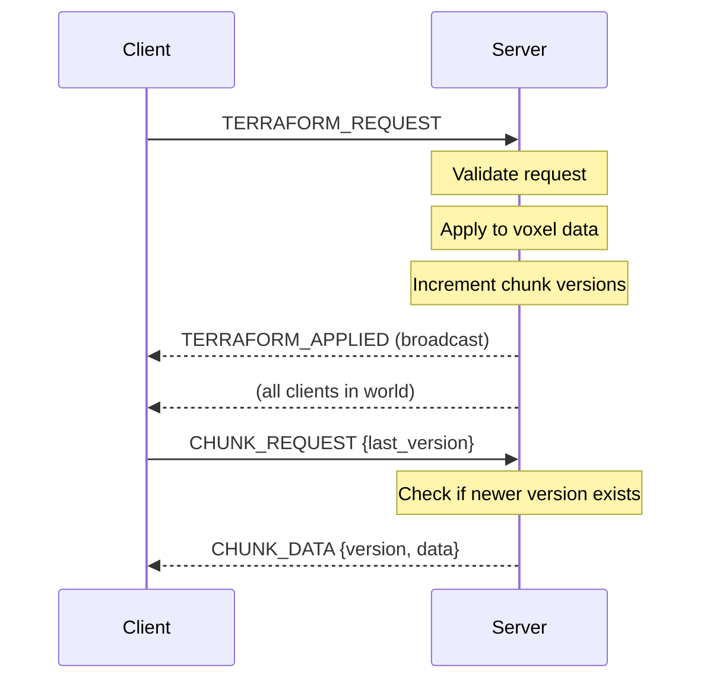

# Voxel Terrain Synchronization

This document describes how voxel terrain is synchronized between server and clients.

## Overview

The voxel terrain uses a **chunk-based** system with **server authority**:

- World is divided into 32×32×32 voxel chunks
- Server owns canonical chunk data
- Each chunk has a version number
- Clients request chunks and cache locally
- Terraform operations modify chunks atomically

```
┌─────────────────────────────────────────────────────────────────────┐
│                           World Grid                                 │
│  ┌─────┬─────┬─────┬─────┬─────┬─────┬─────┬─────┐                  │
│  │-2,1 │-1,1 │ 0,1 │ 1,1 │ 2,1 │ 3,1 │ 4,1 │ 5,1 │  ← chunk_id     │
│  │ v3  │ v1  │ v5  │ v2  │ v0  │ v0  │ v0  │ v0  │    (cx, cy, cz)  │
│  ├─────┼─────┼─────┼─────┼─────┼─────┼─────┼─────┤    version       │
│  │-2,0 │-1,0 │ 0,0 │ 1,0 │ 2,0 │ 3,0 │ 4,0 │ 5,0 │                  │
│  │ v2  │ v7  │ v12 │ v8  │ v3  │ v1  │ v0  │ v0  │                  │
│  └─────┴─────┴─────┴─────┴─────┴─────┴─────┴─────┘                  │
│                           32 units                                   │
└─────────────────────────────────────────────────────────────────────┘
```

## Chunk Data Structure

### Chunk Identification

Chunks are identified by integer coordinates:

```
chunk_id = [cx, cy, cz]
```

World position to chunk conversion:

```gdscript
func world_to_chunk(world_pos: Vector3) -> Array:
    var cx := int(floor(world_pos.x / CHUNK_SIZE))
    var cy := int(floor(world_pos.y / CHUNK_SIZE))
    var cz := int(floor(world_pos.z / CHUNK_SIZE))
    return [cx, cy, cz]
```

### Voxel Storage

Each chunk stores voxel data as a flat byte array:

```gdscript
class ChunkData:
    var chunk_id: Array = [0, 0, 0]
    var version: int = 0
    var voxels: PackedByteArray  # 32*32*32 = 32,768 bytes
```

Voxel index calculation:

```gdscript
func get_voxel_index(x: int, y: int, z: int) -> int:
    return x + y * CHUNK_SIZE + z * CHUNK_SIZE * CHUNK_SIZE
```

Voxel values:
- `0` = Air (empty)
- `1` = Solid terrain
- `2+` = Different materials

### Chunk Versioning

Each chunk has a monotonically increasing version number:

```
Initial state:     version = 0
After terraform:   version = 1
After terraform:   version = 2
...
```

Clients track last known version and only request updates when:
1. They don't have the chunk at all
2. Their cached version < server version

## Terraform Operations

### Operation Types

```gdscript
enum TerraformOp {
    SPHERE_ADD = 1,   # Add solid terrain in sphere
    SPHERE_SUB = 2,   # Remove terrain in sphere
    PAINT = 3,        # Change material in sphere
}
```

### Request Flow



### Request Message

```json
{
    "type": 3,
    "op_type": 1,
    "center": [10.0, 5.0, 20.0],
    "radius": 3.0,
    "material_id": 1,
    "client_sequence_id": 42
}
```

### Applied Message

```json
{
    "type": 106,
    "server_tick": 50400,
    "op_type": 1,
    "center": [10.0, 5.0, 20.0],
    "radius": 3.0,
    "material_id": 1,
    "affected_chunks": [
        {"chunk_id": [0, 0, 0], "new_version": 13},
        {"chunk_id": [1, 0, 0], "new_version": 5}
    ],
    "client_sequence_id": 42
}
```

## Chunk Synchronization

### Client Chunk Cache

```gdscript
class ChunkCache:
    var _chunks: Dictionary = {}  # "cx_cy_cz" -> CachedChunk
    var _pending_requests: Dictionary = {}
    
    func request_chunk(cx: int, cy: int, cz: int) -> void:
        var key := "%d_%d_%d" % [cx, cy, cz]
        
        # Avoid duplicate requests
        if _pending_requests.has(key):
            return
        
        var last_version := 0
        var cached := _chunks.get(key)
        if cached:
            last_version = cached.version
        
        _pending_requests[key] = Time.get_unix_time_from_system()
        GameClient.request_chunk([cx, cy, cz], last_version)
```

### Chunk Request

```json
{
    "type": 4,
    "chunk_id": [0, 0, 0],
    "last_known_version": 5
}
```

Server response:
- If `last_known_version >= server_version`: No response (client already up-to-date)
- Otherwise: Send full chunk data

### Chunk Data Response

```json
{
    "type": 107,
    "chunk_id": [0, 0, 0],
    "version": 13,
    "data": "H4sIAAAAAAAA...",
    "compressed": true
}
```

Data is GZIP compressed for bandwidth efficiency.

## Compression

### Current Implementation

Simple GZIP compression:

```gdscript
# Server compress
func compress_chunk(chunk: ChunkData) -> PackedByteArray:
    return chunk.voxels.compress(FileAccess.COMPRESSION_GZIP)

# Client decompress
func decompress_chunk(data: PackedByteArray) -> PackedByteArray:
    return data.decompress(CHUNK_SIZE^3, FileAccess.COMPRESSION_GZIP)
```

### Compression Ratios

| Chunk Content | Raw Size | Compressed | Ratio |
|--------------|----------|------------|-------|
| Empty (all air) | 32 KB | ~100 bytes | 99.7% |
| Solid (all same) | 32 KB | ~100 bytes | 99.7% |
| Mixed terrain | 32 KB | ~2-8 KB | 75-94% |

## Client-Side Prediction

### Immediate Visual Feedback

When client sends terraform request:

1. Apply operation locally (prediction)
2. Update chunk visuals immediately
3. When server confirms, replace with authoritative data

```gdscript
func _on_terraform_applied(op_type, center, radius, material_id):
    # Request affected chunks for authoritative data
    var min_pos := center - Vector3.ONE * radius
    var max_pos := center + Vector3.ONE * radius
    
    # Calculate affected chunk range
    var min_chunk := world_to_chunk(min_pos)
    var max_chunk := world_to_chunk(max_pos)
    
    # Request all affected chunks
    for cx in range(min_chunk[0], max_chunk[0] + 1):
        for cy in range(min_chunk[1], max_chunk[1] + 1):
            for cz in range(min_chunk[2], max_chunk[2] + 1):
                request_chunk(cx, cy, cz)
```

### Misprediction Handling

If server rejects terraform (e.g., validation failure):
- Client receives no TERRAFORM_APPLIED
- Local prediction remains until chunk sync
- On next chunk request, authoritative data overwrites prediction

## Persistence

### Save Format

World state includes chunk data:

```json
{
    "world_id": "world_abc123",
    "chunks": [
        {
            "chunk_id": [0, 0, 0],
            "version": 13,
            "data": "base64_compressed_voxels"
        },
        {
            "chunk_id": [1, 0, 0],
            "version": 5,
            "data": "base64_compressed_voxels"
        }
    ]
}
```

### Loading

When game server starts:

1. Request world state from control plane
2. Decompress and load chunk data
3. Restore chunk versions

When client joins:

1. Receive HANDSHAKE_RESPONSE with world_id
2. Request chunks as needed (based on proximity)
3. Cache received chunks locally

## Visualization

### Current Implementation

Simple CSG-based visualization for testing:

```gdscript
func _update_chunk_visual(cached: CachedChunk):
    # Count solid voxels
    var solid_count := 0
    for i in range(cached.voxels.size()):
        if cached.voxels[i] != 0:
            solid_count += 1
    
    if solid_count > 0:
        # Create box showing chunk bounds
        var mesh := BoxMesh.new()
        mesh.size = Vector3(CHUNK_SIZE, CHUNK_SIZE, CHUNK_SIZE)
        # ...
```

### Production Implementation (Future)

For production, use proper mesh generation:

1. **Marching Cubes** for smooth terrain
2. **Greedy Meshing** for blocky terrain
3. **LOD system** for distant chunks
4. **Mesh caching** to avoid regeneration

## Performance Considerations

### Bandwidth

| Operation | Size | Frequency |
|-----------|------|-----------|
| Terraform request | ~100 bytes | On player action |
| Terraform applied | ~200 bytes | Broadcast to all |
| Chunk request | ~50 bytes | On chunk miss |
| Chunk data | 100B - 8KB | On request |

### Memory

Per chunk (client):
- Voxel data: 32 KB raw
- Visual mesh: Variable (depends on complexity)

Recommended: Only cache chunks within view distance

### CPU

Chunk operations:
- Sphere terraform: O(r³) voxel writes
- Chunk compression: O(n) with GZIP

## Future Improvements

### Delta Compression

Instead of full chunk data, send only changed voxels:

```json
{
    "type": 107,
    "chunk_id": [0, 0, 0],
    "base_version": 12,
    "new_version": 13,
    "changes": [
        {"idx": 1234, "val": 1},
        {"idx": 1235, "val": 1}
    ]
}
```

### Streaming

For large worlds:
- Priority queue based on distance
- Chunk unloading for distant areas
- Level-of-detail for far chunks

### Collaboration

Multiple simultaneous terraformers:
- Conflict resolution (last-write-wins)
- Operation batching
- Undo/redo support
