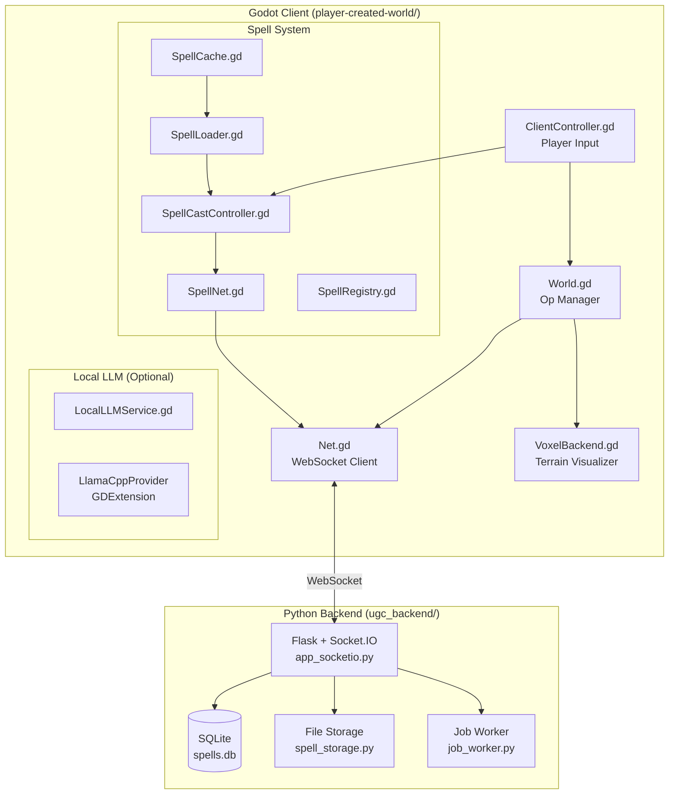
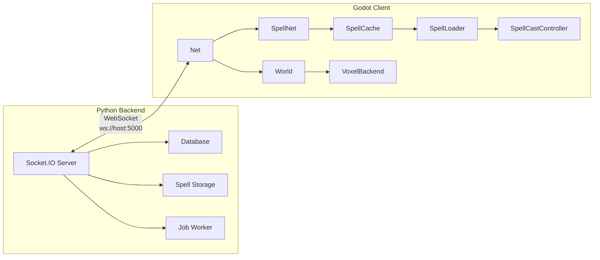
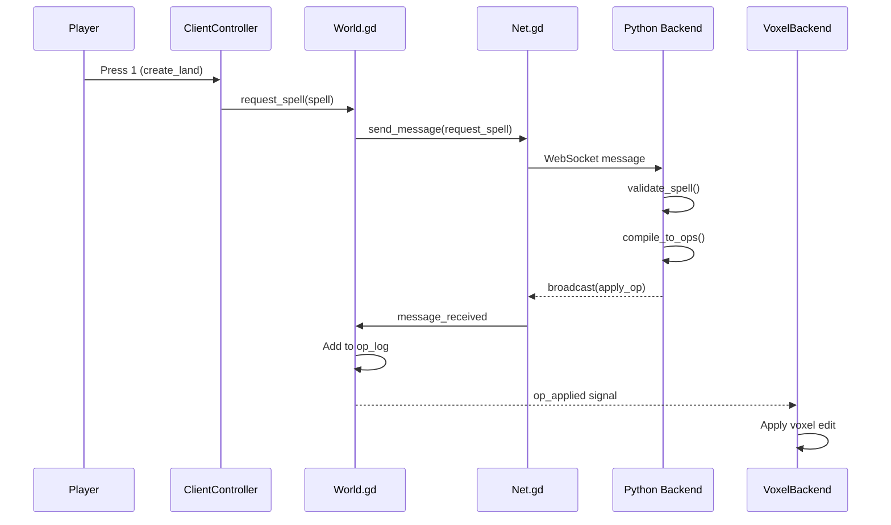
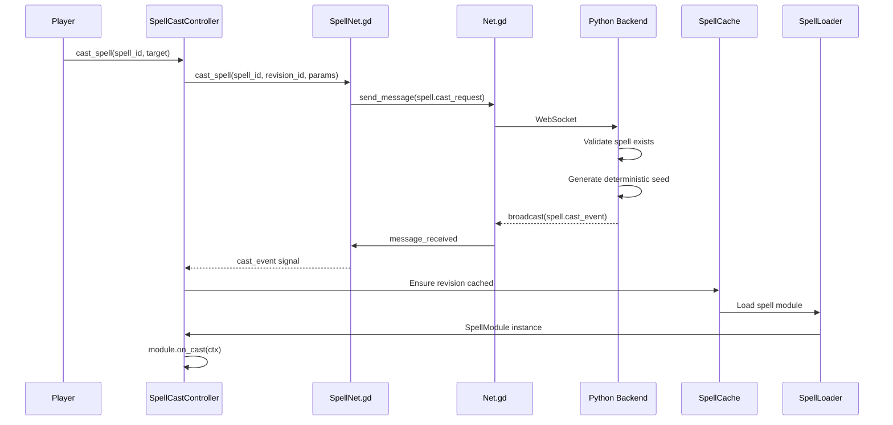

# Architecture

This document describes the overall system architecture for the UGC World project - a multiplayer voxel game with player-created spells powered by local LLM inference.

## Core Architecture



## System Overview

The architecture follows a **server-authoritative** model where:

- **Python Backend** validates all spell requests and broadcasts operations
- **Godot Clients** send intents (spell requests) and apply received operations locally
- **Multi-World Architecture** allows a single server to host multiple independent worlds
- **Spell Packages** are versioned, immutable builds that can be hot-loaded
- **Local LLM** provides offline AI inference for spell generation (optional)

### Multi-World Architecture

A single server can host multiple independent worlds:

1. **Connection Flow**:
   - Client connects to server
   - Client receives world list
   - Client creates or joins a world
   - Client receives world-specific state sync

2. **World Isolation**:
   - Each world has its own operation log
   - Spell casts are broadcast only within a world
   - Clients can switch between worlds

3. **Shared Resources**:
   - Spells are global (available in all worlds)
   - Build jobs are server-wide

## Component Diagram



## Data Flow

### Legacy Voxel Operations



### New Spell System Flow



## Key Concepts

### Operations (Ops)

Operations are atomic units of world mutation. They are broadcast from the server to all clients.

```json
{
    "op": "add_sphere",
    "center": {"x": 0, "y": 10, "z": 0},
    "radius": 8.0,
    "material_id": 1
}
```

Current op types:
- `add_sphere` - Add terrain in a spherical region
- `subtract_sphere` - Remove terrain in a spherical region

### Spells (Legacy)

Legacy spells are simple intents that compile to ops on the server:

```json
{
    "type": "create_land",
    "center": {"x": 0, "y": 10, "z": 0},
    "radius": 8.0,
    "material_id": 1
}
```

### Spell Packages (New System)

The new spell system uses versioned packages with hot-loading:

- **spell_id**: Stable identifier (e.g., `demo_spark`)
- **revision_id**: Immutable build (e.g., `rev_000001_a3b4c5d6`)
- **channel**: Distribution channel (`draft`, `beta`, `stable`)

See [SPELLS.md](./SPELLS.md) for full documentation.

### World Join and Sync

When a client joins a world:
1. Client sends `world.join` with world_id
2. Server adds client to world room
3. Server sends `sync_ops` with world's operation log
4. Client replays all ops to reconstruct world state
5. Client emits `sync_complete` signal

When a client leaves or switches worlds:
1. Previous world's ops are cleared locally
2. New world's ops are synced

## Files Reference

### Python Backend (`ugc_backend/`)

| File | Purpose |
|------|---------|
| `app_socketio.py` | Main Socket.IO server, spell handling |
| `database.py` | SQLite database for spell metadata |
| `spell_storage.py` | File system storage for spell packages |
| `job_worker.py` | Background build job processor |
| `requirements.txt` | Python dependencies |

### Godot Client (`player-created-world/`)

| File | Purpose |
|------|---------|
| `shared/scripts/net/Net.gd` | WebSocket client (autoload) |
| `shared/scripts/world/World.gd` | Op handling, legacy spell requests (autoload) |
| `shared/scripts/world/VoxelBackend.gd` | Terrain visualization |
| `shared/scripts/spells/SpellNet.gd` | Spell network communication (autoload) |
| `shared/scripts/spells/SpellCache.gd` | Local spell caching (autoload) |
| `shared/scripts/spells/SpellLoader.gd` | Script hot-loading (autoload) |
| `shared/scripts/spells/SpellRegistry.gd` | Active revision tracking (autoload) |
| `shared/scripts/spells/SpellCastController.gd` | Cast execution (autoload) |
| `shared/scripts/spells/SpellModule.gd` | Base class for spells |
| `shared/scripts/spells/SpellContext.gd` | Execution context |
| `shared/scripts/spells/WorldAPIAdapter.gd` | Safe world interaction API |
| `client/scripts/ClientController.gd` | Player input, world/connection flow |
| `client/scripts/WorldSelectionDialog.gd` | World selection UI |
| `client/scripts/ConnectionDialog.gd` | Server connection UI |
| `client/scenes/Main.tscn` | Main game scene |
| `client/scenes/WorldSelectionDialog.tscn` | World selection dialog scene |
| `client/scenes/ConnectionDialog.tscn` | Connection dialog scene |

### Local LLM (`addons/local_llm/`)

| File | Purpose |
|------|---------|
| `scripts/LocalLLMService.gd` | Main LLM autoload singleton |
| `scripts/ModelRegistry.gd` | Model metadata management |
| `bin/*.dll` / `*.so` | Compiled GDExtension binaries |
| `src/` | C++ source for llama.cpp wrapper |

## Running

### 1. Start Backend

```bash
cd ugc_backend
pip install -r requirements.txt
python app_socketio.py
```

Server starts on `ws://0.0.0.0:5000`.

### 2. Run Client

Open Godot, run `client/scenes/Main.tscn`

Or from command line:
```bash
cd player-created-world
godot --main-scene client/scenes/Main.tscn
```

### Controls

| Key | Action |
|-----|--------|
| C / Enter | Open connection/world selection dialog |
| 1 | Cast create_land (legacy voxel) |
| 2 | Cast dig (legacy voxel) |
| 3 | Cast demo_spark (new spell system) |
| 4 | Cast demo_spawn (new spell system) |
| 5 | Build demo_spark |
| 6 | Build demo_spawn |
| 7 | Publish demo_spark to beta |
| 8 | Publish demo_spawn to beta |
| WASD | Move camera |
| Right-click | Toggle mouse look |
| Shift | Move faster |

Note: When connected, press C to open world selection. Most spell actions require being in a world first.

## Connection Modes

The client supports multiple connection modes:

- **Localhost**: `ws://127.0.0.1:5000` (development)
- **Production**: `wss://ugc-world-backend.fly.dev` (deployed)
- **Custom**: Any `ws://` or `wss://` URL

In release builds, the client automatically connects to production. In the editor, use the connection dialog (press C).

## Extending

### Adding Spell Types (Legacy)

1. **Backend** (`app_socketio.py`): Handle in `handle_legacy_spell()`
2. **Client** (`VoxelBackend.gd`): Handle new op types

### Adding New Spell Packages

1. Create spell code extending `SpellModule`
2. Build via server: `SpellNet.start_build(spell_id, {code: ...})`
3. Publish: `SpellNet.publish_revision(spell_id, revision_id, "beta")`
4. Cast: `SpellCastController.cast_spell(spell_id, target)`

### Adding Validation

Spell validation happens on the server in `app_socketio.py`:
- Check player permissions
- Validate mana cost
- Anti-cheat checks

## Deployment

The backend can be deployed to Fly.io:

```bash
cd ugc_backend
fly deploy
```

See `fly.toml` for configuration.
