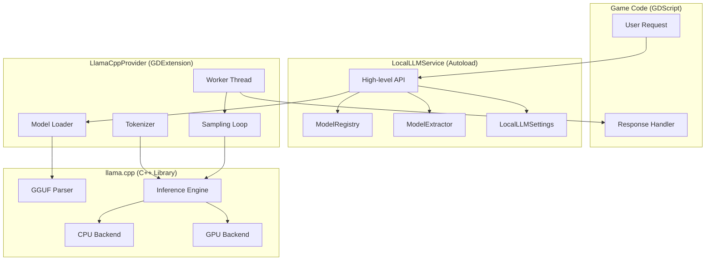
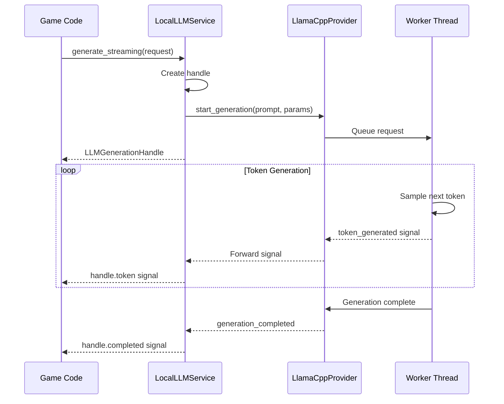

# Local LLM Integration

Fully embedded, offline LLM runtime for the Godot game client. Ships with Qwen2.5-Coder 14B via llama.cpp, with no external dependencies or network calls required.

## Overview

The Local LLM system provides:
- **Fully offline inference** - No API keys, no internet required
- **Embedded model distribution** - Model ships with the game installer
- **Non-blocking generation** - Streaming tokens, cancellable requests
- **Extensible architecture** - Add new models without code changes
- **Cross-platform support** - Windows + Linux (macOS compatible design)

## Architecture



## Generation Flow



## Quick Start

### Using in GDScript

```gdscript
# Simple generation (blocking)
var result = await LocalLLMService.generate("Write hello world in Python")
print(result.text)

# Streaming generation
var handle = LocalLLMService.generate_streaming({
    "prompt": "Explain recursion",
    "max_tokens": 256,
    "temperature": 0.7
})

handle.token.connect(func(chunk): print(chunk))
handle.completed.connect(func(text): print("Done!"))
handle.error.connect(func(err): print("Error: ", err))

# Cancel if needed
handle.request_cancel()
```

### Loading a Model

```gdscript
# Load by model ID from models.json
var result = await LocalLLMService.load_model("qwen2.5-coder-14b-q4_k_m")
if result.success:
    print("Model loaded!")
else:
    print("Failed: ", result.error)

# Check status
var status = LocalLLMService.get_status()
print("Loaded: ", status.loaded)
print("Model: ", status.model_id)
print("Backend: ", status.backend)
```

## File Structure

```
player-created-world/
    addons/
        local_llm/
            bin/                          # Compiled extension binaries
                liblocal_llm.windows.editor.x86_64.dll
                liblocal_llm.windows.template_release.x86_64.dll
                liblocal_llm.linux.editor.x86_64.so
                liblocal_llm.linux.template_release.x86_64.so
            scenes/
                LLMDebug.tscn             # Debug/test UI scene
            scripts/
                LocalLLMService.gd        # Main autoload singleton
                ModelRegistry.gd          # Model metadata management
                ModelExtractor.gd         # PCK to disk extraction
                LocalLLMSettings.gd       # User settings
                LLMDebugUI.gd             # Debug UI controller
                ContextManager.gd         # Context management
                PromptTemplates.gd        # Prompt formatting
                ILLMProvider.gd           # Provider interface
                LLMBenchmark.gd           # Performance testing
            src/                          # C++ extension source
                register_types.cpp
                llama_cpp_provider.cpp
                llm_generation_handle.cpp
            local_llm.gdextension
            plugin.cfg
    models/
        models.json                       # Model registry
        qwen2.5-coder-14b-instruct-q4_k_m.gguf   # GGUF model file
```

## Adding a New Model

Adding a new GGUF model requires **no code changes**:

### Step 1: Obtain the GGUF File

Download or convert your model to GGUF format. Recommended sources:
- Hugging Face: https://huggingface.co/models?library=gguf
- Convert using llama.cpp convert.py

### Step 2: Place the File

Copy the .gguf file to res://models/:

```
models/
    models.json
    qwen2.5-coder-14b-instruct-q4_k_m.gguf  # existing
    my-new-model-q5_k_m.gguf                 # new
```

### Step 3: Update models.json

Add an entry to models.json:

```json
{
    "id": "my-new-model-q5_k_m",
    "display_name": "My New Model (Q5_K_M)",
    "backend": "llama.cpp",
    "context_length": 8192,
    "recommended_threads": 4,
    "quantization": "Q5_K_M",
    "file_path_in_pck": "res://models/my-new-model-q5_k_m.gguf",
    "sha256": "abc123...",
    "size_bytes": 5000000000,
    "estimated_memory": 6000000000,
    "description": "My custom model for specific tasks",
    "tags": ["custom", "5b"],
    "prompt_template": {
        "system_prefix": "<|system|>\n",
        "system_suffix": "</s>\n",
        "user_prefix": "<|user|>\n",
        "user_suffix": "</s>\n",
        "assistant_prefix": "<|assistant|>\n",
        "assistant_suffix": "</s>\n"
    }
}
```

### Step 4: Compute SHA256 (Optional but Recommended)

```bash
# Linux/macOS
sha256sum my-new-model-q5_k_m.gguf

# Windows PowerShell
Get-FileHash my-new-model-q5_k_m.gguf -Algorithm SHA256
```

Add the hash to models.json for integrity verification.

## Model Registry Schema

| Field | Type | Required | Description |
|-------|------|----------|-------------|
| id | string | Yes | Unique identifier |
| display_name | string | No | Human-readable name |
| backend | string | No | Backend type (always llama.cpp) |
| context_length | int | No | Max context window size |
| recommended_threads | int | No | Suggested CPU thread count |
| quantization | string | No | Quantization method (Q4_K_M, etc.) |
| file_path_in_pck | string | Yes | Path in Godot project |
| sha256 | string | No | SHA256 hash for verification |
| size_bytes | int | Yes | File size in bytes |
| estimated_memory | int | No | RAM requirement estimate |
| description | string | No | Model description |
| tags | array | No | Searchable tags |
| prompt_template | object | No | Chat format template |

## Building from Source

### Prerequisites

- **Windows**: Visual Studio 2022 with C++ workload, Python 3, SCons
- **Linux**: GCC/Clang, CMake, Python 3, SCons
- **Both**: Git for submodule management

### Build Steps

#### Windows

```powershell
cd scripts
.\build_llm_win.ps1

# With CUDA support
.\build_llm_win.ps1 -CudaSupport

# Clean build
.\build_llm_win.ps1 -Clean -Target release
```

#### Linux

```bash
cd scripts
chmod +x build_llm_linux.sh
./build_llm_linux.sh

# With CUDA support
./build_llm_linux.sh --cuda

# With Vulkan support
./build_llm_linux.sh --vulkan
```

### Build Output

The build produces platform-specific binaries in addons/local_llm/bin/:

```
bin/
    liblocal_llm.windows.editor.x86_64.dll
    liblocal_llm.windows.template_release.x86_64.dll
    liblocal_llm.linux.editor.x86_64.so
    liblocal_llm.linux.template_release.x86_64.so
```

## Packaging for Distribution

### Model Embedding Strategy

GGUF files are large (8+ GB for 14B Q4 models). Options:

1. **Include in PCK** - Works for smaller models (less than 2GB)
2. **External file** - Ship model alongside executable
3. **First-run extraction** - Extract from PCK to user directory

The current implementation uses option 3: models are embedded in the PCK but extracted to user://models_cache/ on first load because llama.cpp requires filesystem paths.

### Creating a Release Build

```powershell
# Windows
cd scripts
.\package_game.ps1 -Platform windows -ModelPath "models\qwen2.5-coder-14b-q4_k_m.gguf"
```

This creates:

```
dist/
    windows/
        PlayerCreatedWorld.exe
        PlayerCreatedWorld.pck
        liblocal_llm.windows.template_release.x86_64.dll
        models/
            models.json
            qwen2.5-coder-14b-q4_k_m.gguf
```

## Performance Tuning

### Thread Count

```gdscript
# Auto-detect optimal threads (default)
LocalLLMService.get_settings().n_threads = 0

# Or set manually
LocalLLMService.get_settings().n_threads = 8
```

Recommended: min(physical_cores, 8). More threads have diminishing returns.

### Context Length

Larger contexts use more memory. Default is model max, but can be reduced:

```gdscript
LocalLLMService.get_settings().context_length = 4096  # Reduce from 32K
```

### GPU Offloading

If built with CUDA/Metal/Vulkan support:

```gdscript
# Check if GPU available
if LocalLLMService.is_gpu_available():
    LocalLLMService.get_settings().n_gpu_layers = 35  # Offload 35 layers
```

### Memory Estimates

| Model | Quant | File Size | RAM Required |
|-------|-------|-----------|--------------|
| Qwen2.5-Coder 14B | Q4_K_M | ~8.3 GB | ~10 GB |
| Qwen2.5-Coder 14B | Q5_K_M | ~9.9 GB | ~12 GB |
| Qwen2.5-Coder 14B | Q8_0 | ~14.8 GB | ~17 GB |

## API Reference

### LocalLLMService (Autoload)

```gdscript
# Properties
func is_ready() -> bool
func get_init_error() -> String
func is_model_loaded() -> bool
func get_loaded_model_id() -> String

# Model Management
func list_models() -> Array[Dictionary]
func load_model(model_id: String) -> Dictionary  # async
func unload_model() -> void

# Generation
func generate(prompt: String, options: Dictionary = {}) -> Dictionary  # async
func generate_streaming(request: Dictionary) -> LLMGenerationHandle
func cancel_generation(handle_id: String) -> void

# Utilities
func get_status() -> Dictionary
func estimate_tokens(text: String) -> int
func get_recommended_threads() -> int
func is_gpu_available() -> bool

# Signals
signal model_loading(model_id: String)
signal model_loaded(model_id: String)
signal model_load_failed(model_id: String, error: String)
signal model_unloaded()
signal generation_started(handle_id: String)
signal generation_completed(handle_id: String, text: String)
signal generation_failed(handle_id: String, error: String)
```

### LLMGenerationHandle

```gdscript
# Properties
func get_id() -> String
func get_model_id() -> String
func get_status() -> Status  # PENDING, RUNNING, COMPLETED, CANCELLED, ERROR
func get_full_text() -> String
func get_error_message() -> String
func get_tokens_generated() -> int
func get_elapsed_seconds() -> float
func get_tokens_per_second() -> float

# Methods
func request_cancel() -> void

# Signals
signal token(text_chunk: String)
signal completed(full_text: String)
signal error(message: String)
signal cancelled()
```

### LLMRequest Dictionary

```gdscript
{
    "prompt": String,              # Required: Input text
    "system_prompt": String,       # Optional: System instructions
    "max_tokens": int,             # Default: 512
    "temperature": float,          # Default: 0.7 (0.0-2.0)
    "top_p": float,                # Default: 0.9 (0.0-1.0)
    "top_k": int,                  # Default: 40
    "repeat_penalty": float,       # Default: 1.1
    "stop_sequences": PackedStringArray,  # Stop generation strings
    "seed": int,                   # -1 for random
    "stream": bool                 # Default: true
}
```

## Troubleshooting

### Extension not loaded

- Ensure .dll/.so files are in addons/local_llm/bin/
- Check Godot console for loading errors
- Verify local_llm.gdextension paths match actual files

### Model file not found

- Verify file_path_in_pck in models.json matches actual file location
- Check if model was properly included in export

### Failed to load model / Out of Memory

- Check available RAM against estimated_memory in models.json
- Try a smaller quantization (Q4 vs Q8)
- Reduce context_length in settings

### Slow Generation

- Increase thread count (up to physical core count)
- Enable GPU offloading if available
- Use a smaller/more quantized model

### Hash Mismatch

- Model file may be corrupted during download
- Re-download and update sha256 in models.json

## Current Models

The project ships with Qwen 2.5 Coder 14B configurations:

| Model ID | Quantization | Size | Context | Description |
|----------|--------------|------|---------|-------------|
| qwen2.5-coder-14b-q4_k_m | Q4_K_M | 8.7 GB | 32K | Default, balanced quality/speed |
| qwen2.5-coder-14b-q5_k_m | Q5_K_M | 10.4 GB | 32K | Higher quality, more memory |

## License

- **Local LLM Extension**: MIT License (same as project)
- **llama.cpp**: MIT License
- **Qwen2.5-Coder**: Apache 2.0 License (check model license before distribution)

## Credits

- llama.cpp: https://github.com/ggerganov/llama.cpp by Georgi Gerganov
- Qwen2.5-Coder: https://github.com/QwenLM/Qwen2.5-Coder by Alibaba Cloud
- godot-cpp: https://github.com/godotengine/godot-cpp by Godot Engine contributors
