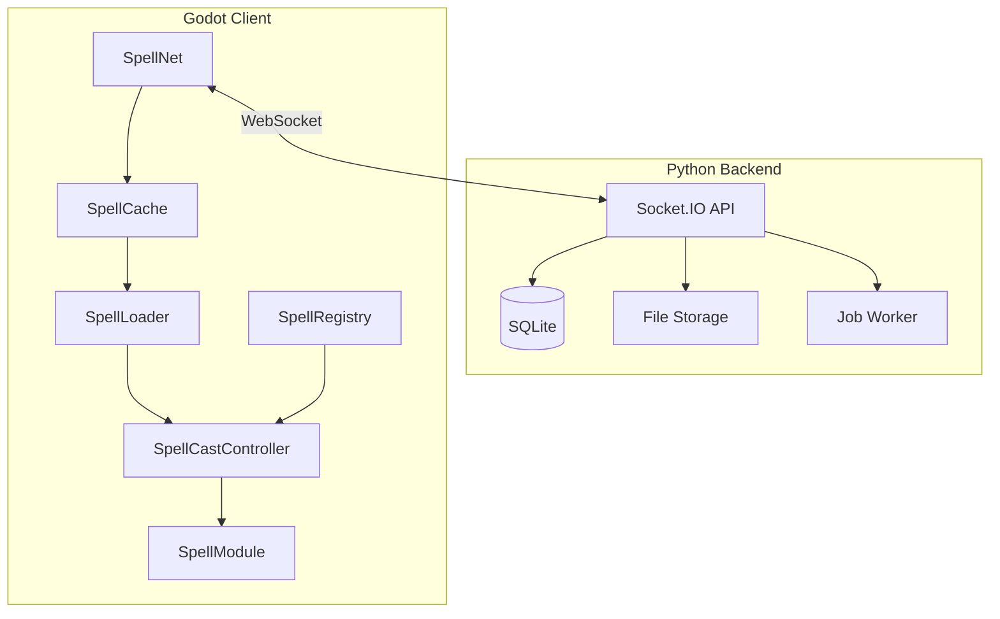
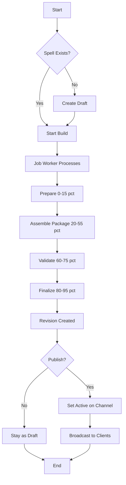
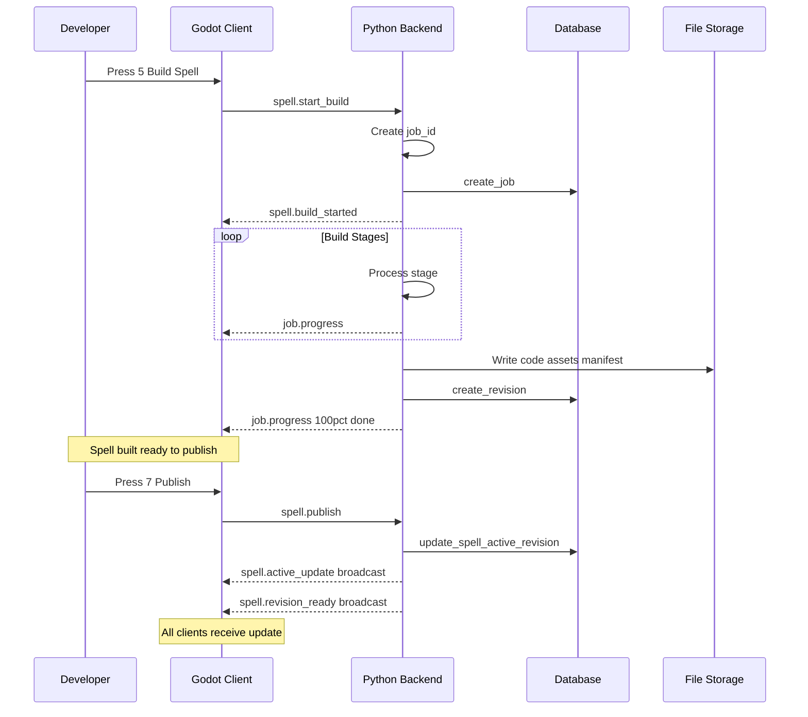
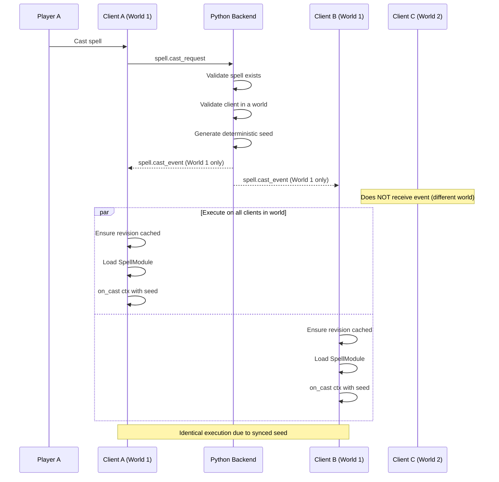

# Spell Package System

This document describes the spell package system that allows players to create, distribute, and cast custom spells with hot-loading support.

## Overview

The spell system enables:
- **Versioned spell packages**: Each spell has immutable revisions with code, assets, and metadata
- **Build pipeline**: Server-side job system for creating spell revisions
- **Hot-loading**: Clients can download and execute new spells without restart
- **Multiplayer sync**: All clients in the same world execute spells deterministically from server-broadcast events
- **Multi-world support**: Spell packages are global, but spell casts are scoped to individual worlds

## System Architecture



## Core Concepts

| Concept | Description |
|---------|-------------|
| spell_id | Stable identifier (e.g., fireball, demo_spark) |
| revision_id | Immutable build output (e.g., rev_000001_a3b4c5d6) |
| channel | Distribution channel: draft, beta, stable |
| active_revision | Currently selected revision per channel |

## Spell Creation Flow



## Spell Publishing Flow



## Cast Synchronization Flow

Spells are cast within a specific world. Only clients in the same world receive cast events.



**Note**: Clients must join a world before casting spells. Spell packages themselves are global (available in all worlds).

## Components

### Server (Flask + Socket.IO)

| File | Purpose |
|------|---------|
| app_socketio.py | WebSocket server with spell events |
| database.py | SQLite schema for spells, revisions, jobs |
| spell_storage.py | File system operations for packages |
| job_worker.py | Background build job processor |

### Client (Godot Autoloads)

| Component | Purpose |
|-----------|---------|
| SpellNet | Network communication for spell events |
| SpellCache | Local cache management and downloads |
| SpellLoader | Hot-loading of scripts and assets |
| SpellRegistry | Maps spell IDs to active revisions |
| SpellCastController | Manages cast flow and execution |

### Spell Interface

| Class | Purpose |
|-------|---------|
| SpellModule | Base class for spell implementations |
| SpellContext | Context passed to spell methods |
| WorldAPIAdapter | Safe world interaction API |

## Spell Package Format

Each revision is stored at:

```
data/spells/SPELL_ID/revisions/REVISION_ID/
    manifest.json
    code/
        spell.gd
    assets/
        icon.png
    text/
        description.md
```

### manifest.json

```json
{
  "spell_id": "demo_spark",
  "revision_id": "rev_000001_a3b4c5d6",
  "version": 1,
  "created_at": "2026-02-01T12:00:00Z",
  "entrypoint": "code/spell.gd",
  "language": "gdscript",
  "interface_version": "1.0",
  "code": [
    {"path": "code/spell.gd", "hash": "sha256...", "size": 1234}
  ],
  "assets": [
    {"path": "assets/icon.png", "hash": "sha256...", "size": 5678}
  ],
  "metadata": {
    "name": "Demo Spark",
    "description": "Creates a colorful spark effect",
    "tags": ["effect", "visual"],
    "preview_icon": "assets/icon.png"
  }
}
```

## Spell Interface Contract

Spells must extend SpellModule and implement:

```gdscript
extends SpellModule

# Required: Called when the spell is cast
func on_cast(ctx: SpellContext) -> void:
    print("Spell cast at: ", ctx.target_position)
    ctx.world.play_vfx("effect", ctx.target_position, {"color": Color.CYAN})

# Optional: Return metadata
func get_manifest() -> Dictionary:
    return {"name": "My Spell", "description": "Does something cool"}

# Optional: Called each frame for ongoing effects
func on_tick(ctx: SpellContext, dt: float) -> void:
    pass

# Optional: Called when spell is cancelled
func on_cancel(ctx: SpellContext) -> void:
    pass

# Optional: Handle custom events
func on_event(ctx: SpellContext, event: Dictionary) -> void:
    pass
```

### SpellContext Properties

| Property | Type | Description |
|----------|------|-------------|
| caster_id | String | ID of the casting player |
| world_id | String | ID of the world where spell is being cast |
| target_position | Vector3 | World position target |
| target_entity_id | String | Entity being targeted if any |
| world | WorldAPIAdapter | Interface for world interactions |
| random_seed | int | Deterministic seed for synced random |
| rng | RandomNumberGenerator | Pre-seeded RNG |
| mana_budget | float | Available mana for this cast |
| cast_time | float | Unix timestamp of cast |
| tick_index | int | Current tick count |
| params | Dictionary | Custom cast parameters |
| manifest | Dictionary | Spell manifest data |

### WorldAPIAdapter Methods

```gdscript
# Spawn entities
ctx.world.spawn_entity(scene_path, transform, props)
ctx.world.spawn_simple_mesh(mesh, transform, material)

# Visual/audio effects
ctx.world.play_vfx(asset_id, position, params)
ctx.world.play_sound(asset_id, position, params)

# World mutation
ctx.world.set_voxel(position, value)
ctx.world.set_voxel_region(start, end, value)

# Combat
ctx.world.deal_damage(entity_id, amount, damage_type)
ctx.world.query_radius(position, radius, filter)

# Events
ctx.world.emit_event(event_name, event_data)
```

## Network Events

### Server to Client

| Event | Data | Description |
|-------|------|-------------|
| job.progress | job_id, stage, pct, message | Build progress update |
| spell.build_started | job_id, spell_id | Build job started |
| spell.revision_ready | spell_id, revision_id, manifest | New revision available |
| spell.active_update | spell_id, revision_id, channel, manifest | Active revision changed |
| spell.cast_event | spell_id, revision_id, caster_id, world_id, cast_params, seed | Execute a spell (world-scoped) |
| content.file | spell_id, revision_id, path, content, size | File content base64 |
| content.manifest | spell_id, revision_id, manifest | Manifest data |

**Note**: `spell.cast_event` is only sent to clients in the same world as the caster.

### Client to Server

| Event | Data | Description |
|-------|------|-------------|
| world.list | empty | List available worlds |
| world.create | name, description | Create a new world |
| world.join | world_id | Join a world |
| world.leave | empty | Leave current world |
| spell.create_draft | spell_id optional | Create new spell |
| spell.start_build | spell_id, prompt, code, options | Start build job |
| spell.publish | spell_id, revision_id, channel | Publish to channel |
| spell.cast_request | spell_id, revision_id, cast_params | Request spell cast (requires being in a world) |
| spell.list | empty | List all spells |
| spell.get_revisions | spell_id | Get spell revisions |
| content.get_manifest | spell_id, revision_id | Get manifest |
| content.get_file | spell_id, revision_id, path | Get file content |
| content.list_files | spell_id, revision_id | List revision files |

## Build Job Stages

| Stage | Progress | Description |
|-------|----------|-------------|
| prepare | 0-15% | Setup build environment |
| assemble_package | 20-55% | Write code and assets |
| validate | 60-75% | Check spell interface |
| finalize | 80-95% | Compute hashes, write manifest |
| done | 100% | Build complete |

## Cache Locations

Client (Godot):

```
user://spell_cache/SPELL_ID/REVISION_ID/
    manifest.json
    code/spell.gd
    assets/...
```

Server (Flask):

```
ugc_backend/data/spells/SPELL_ID/revisions/REVISION_ID/...
ugc_backend/data/spells.db
```

## Demo Usage

### 1. Start the server

```bash
cd ugc_backend
pip install -r requirements.txt
python app.py
```

Or with Docker:
```bash
cd ugc_backend
docker compose up --build
```

### 2. Run the Godot client

Open project in Godot, press F5

### Connection Flow

1. Press **C** to open the connection dialog
2. Select a server (localhost or production)
3. After connecting, the **World Selection** dialog appears
4. Create a new world or join an existing one
5. You're now ready to build and cast spells!

### 3. Controls

| Key | Action |
|-----|--------|
| C or Enter | Open connection dialog (if disconnected) or world selection (if connected) |
| 5 | Build demo_spark |
| 6 | Build demo_spawn |
| 7 | Publish demo_spark to beta |
| 8 | Publish demo_spawn to beta |
| 3 | Cast demo_spark at cursor (requires being in a world) |
| 4 | Cast demo_spawn at cursor (requires being in a world) |
| WASD | Move camera |
| Right-click | Toggle mouse look |

### 4. Multi-client test

1. Open two Godot instances
2. Both connect to server (press C)
3. Both join the **same world** (create a new one or select existing)
4. One client builds + publishes a spell
5. Both clients can immediately cast it
6. Both clients see the same spell effects

## Database Schema

```sql
-- Worlds hosted by this server
CREATE TABLE worlds (
    world_id TEXT PRIMARY KEY,
    name TEXT NOT NULL,
    description TEXT,
    created_by TEXT,
    player_count INTEGER DEFAULT 0,
    created_at TEXT,
    updated_at TEXT
);

-- World-specific operations (voxel ops, etc.)
CREATE TABLE world_ops (
    op_id INTEGER PRIMARY KEY AUTOINCREMENT,
    world_id TEXT NOT NULL,
    op_type TEXT NOT NULL,
    op_data TEXT NOT NULL,
    created_at TEXT,
    FOREIGN KEY (world_id) REFERENCES worlds(world_id)
);

-- Spells are global (shared across all worlds)
CREATE TABLE spells (
    spell_id TEXT PRIMARY KEY,
    display_name TEXT,
    active_draft_rev TEXT,
    active_beta_rev TEXT,
    active_stable_rev TEXT,
    created_at TEXT,
    updated_at TEXT
);

CREATE TABLE revisions (
    revision_id TEXT PRIMARY KEY,
    spell_id TEXT,
    parent_revision_id TEXT,
    channel TEXT,
    version INTEGER,
    manifest_json TEXT,
    created_at TEXT
);

CREATE TABLE jobs (
    job_id TEXT PRIMARY KEY,
    spell_id TEXT,
    draft_id TEXT,
    status TEXT,
    stage TEXT,
    progress_pct INTEGER,
    logs TEXT,
    error_message TEXT,
    result_revision_id TEXT,
    created_at TEXT,
    updated_at TEXT
);
```

## Hot-Loading Implementation

Since Godot load does not work on user:// paths for scripts in export builds, we use dynamic compilation:

```gdscript
# Read source code from cache
var source_code: String = cache.read_file_text(spell_id, revision_id, "code/spell.gd")

# Create GDScript from source
var script: GDScript = GDScript.new()
script.source_code = source_code

# Compile
var err: Error = script.reload()
if err != OK:
    push_error("Failed to compile script")
    return null

# Instantiate
var module: SpellModule = script.new()
```

This allows loading arbitrary GDScript from any location at runtime.

## Future Improvements

- Security: Sandbox spell execution, capability-based permissions
- CDN: Blob storage for assets with content-addressed deduplication
- Server authority: Move spell simulation to server
- AI generation: Integrate LLM for generating spell code from prompts
- Dependencies: Allow spells to depend on shared libraries
- Mana system: Integrate with SpellCost specification
