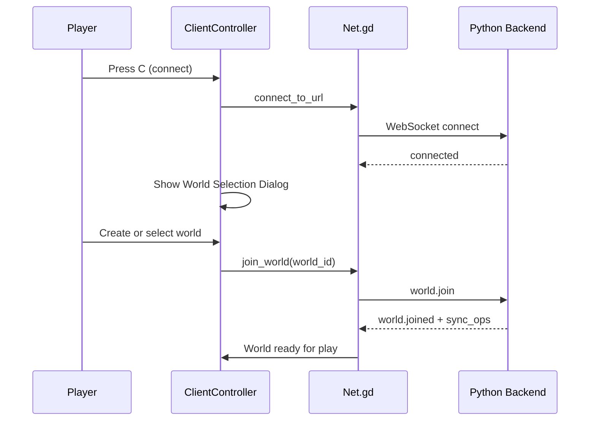
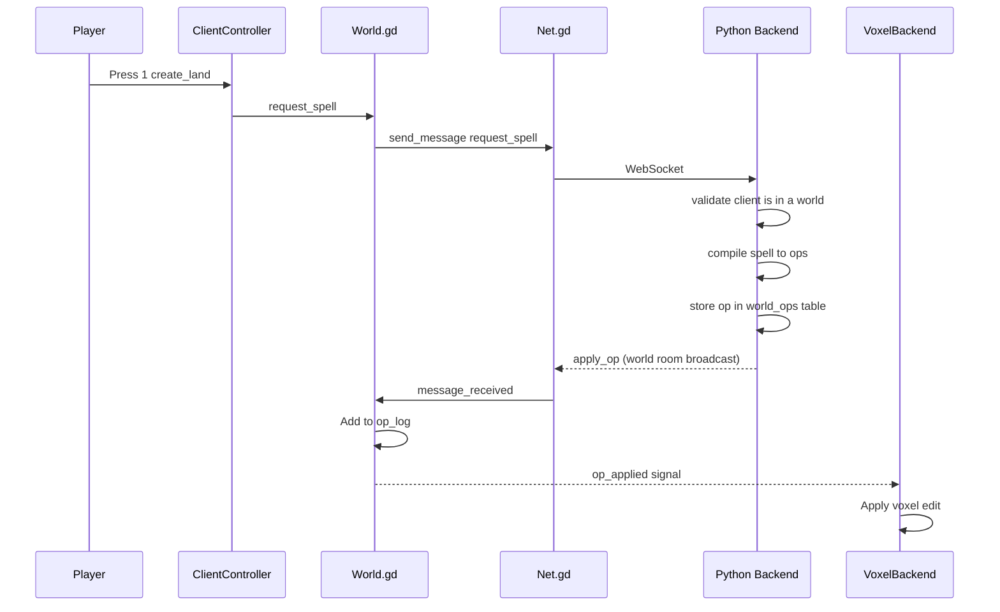

# Voxel Terrain Integration

This document describes how to set up and use the voxel terrain system for live terraforming.

## Overview

The voxel system uses **Voxel Tools for Godot** (by Zylann), a GDExtension addon that provides high-performance editable voxel terrain. This integrates with our existing server-authoritative spell/ops pipeline.

### Multi-World Architecture

A single server can host **multiple independent worlds**. Each world has its own terrain state:

- Clients connect to the server, then select/create a world to join
- Terrain operations are isolated per-world
- Clients in different worlds don't see each other's changes
- World state is persisted in the server database

## Architecture

### Connection and World Join Flow



### Terrain Edit Flow



## Installation: Voxel Tools for Godot

### Option A: Download Pre-built Release (Recommended)

1. Go to: https://github.com/Zylann/godot_voxel/releases
2. Download the release matching your Godot version
3. Extract the addons/zylann.voxel/ folder into player-created-world/addons/

Your folder structure should look like:

```
player-created-world/
    addons/
        zylann.voxel/
            voxel.gdextension
            bin/
                libvoxel.windows.editor.x86_64.dll
                libvoxel.linux.editor.x86_64.so
                libvoxel.macos.editor.universal.framework/
```

4. Restart Godot Editor to load the GDExtension.

### Option B: Build from Source

If no pre-built release matches your Godot version:

1. Clone the repository:
   ```bash
   git clone https://github.com/Zylann/godot_voxel.git
   cd godot_voxel
   git checkout tag-for-your-godot-version
   ```

2. Follow build instructions at: https://voxel-tools.readthedocs.io/en/latest/getting_started/building/

3. Copy the resulting addons/zylann.voxel/ folder to player-created-world/addons/

### Verify Installation

After installation, open the project in Godot. You should see these nodes available:
- VoxelTerrain
- VoxelLodTerrain
- VoxelMesher classes
- VoxelGenerator classes

## Version Constraints

| Component | Version |
|-----------|---------|
| Godot Engine | 4.6+ |
| Voxel Tools | 1.2+ (must match Godot version) |

**Important**: Voxel Tools releases are tied to specific Godot versions. Always download the release that matches your Godot version exactly.

## Running the Demo

### Method 1: Connect to Python Backend

1. Start the Python backend:
   ```bash
   cd ugc_backend
   pip install -r requirements.txt
   python app.py
   ```

2. Run client/scenes/Main.tscn in Godot
3. Press C to open connection dialog, select localhost
4. After connecting, the **World Selection** dialog appears
5. Create a new world (enter a name and click Create) or join an existing one
6. Once in a world, press 1 to create land, 2 to dig

### Method 2: Batch Scripts

```bash
./tools/run_server.sh   # Starts Python backend (not headless Godot)
./tools/run_client.sh   # Starts client
```

## Controls

| Key | Action |
|-----|--------|
| C or Enter | Open connection dialog (if disconnected) or world selection (if connected) |
| 1 | Cast create_land spell (add_sphere) - requires being in a world |
| 2 | Cast dig spell (subtract_sphere) - requires being in a world |
| 3 | Cast demo_spark (new spell system) - requires being in a world |
| 4 | Cast demo_spawn (new spell system) - requires being in a world |
| WASD | Move camera |
| Right-click | Toggle mouse look |
| Shift | Move faster |

**Note**: You must join a world before casting any spells. The world selection dialog appears automatically after connecting to a server.

## How It Works

### Spell to Op to Voxel Pipeline

```mermaid
flowchart LR
    A[Player Input] --> B[ClientController]
    B --> C[World.request_spell]
    C --> D[Net.send_message]
    D --> E[Python Backend]
    E --> F[Validate Spell]
    F --> G[Compile to Ops]
    G --> H[Broadcast apply_op]
    H --> I[All Clients]
    I --> J[World.op_applied signal]
    J --> K[VoxelBackend]
    K --> L[VoxelTool.do_sphere]
```



1. **Client Input**: Player presses a key to cast a spell
2. **Spell Request**: World.request_spell sends to Python backend via WebSocket
3. **Server Compilation**: Backend compiles spell to ops
4. **Broadcast**: Server sends apply_op to all connected clients
5. **Signal**: World.op_applied signal emitted on all clients
6. **Voxel Backend**: VoxelBackend applies edits to VoxelTerrain

### World Join and Sync

The server supports **multiple worlds**. Each world has its own independent terrain state.

When a client joins a world:
1. Client sends `world.join` with the selected world_id
2. Server sends `sync_ops` with that world's operation log
3. Client replays all ops to reconstruct terrain state
4. Client emits `sync_complete` signal

When switching worlds:
1. Client sends `world.leave` to leave current world
2. Local ops are cleared
3. Client sends `world.join` for the new world
4. New world's ops are synced

This ensures all clients in the same world see the same terrain state.

### Server Authority

- Clients only send intent (spell requests)
- Server validates client is in a world before accepting ops
- Server validates, compiles, and broadcasts ops to world members only
- Clients apply ops locally for visuals
- Server maintains per-world op_log in database as canonical history
- Multiple independent worlds can exist on the same server

## Operation Types

| Op Type | Description | Fields |
|---------|-------------|--------|
| add_sphere | Add terrain in spherical region | center, radius, material_id |
| subtract_sphere | Remove terrain in spherical region | center, radius |

Example operation:

```json
{
    "op": "add_sphere",
    "center": {"x": 0, "y": 10, "z": 0},
    "radius": 8.0,
    "material_id": 1
}
```

## Customization

### Adjusting Brush Size

Edit spell parameters in ClientController.gd:

```gdscript
var spell := {
    "type": "create_land",
    "center": target_position,
    "radius": 10.0,        # Change brush size
    "material_id": 1       # Material/voxel type
}
```

### Adding New Op Types

1. Handle in Python backend app_socketio.py in handle_legacy_spell
2. Handle the op in VoxelBackend.gd

### Changing Materials/Voxel Types

The material_id in ops maps to voxel values:
- 0 = Air (empty)
- 1 = Solid (default terrain)
- 2+ = Custom materials (configure in VoxelMesher)

## Fallback Visualizer

If Voxel Tools is not installed, VoxelBackend automatically uses a **fallback CSG visualizer** for testing:

- Creates CSGSphere3D nodes to represent add/subtract operations
- Shows approximately where terrain edits would occur
- Useful for testing the network/op pipeline without the addon

**Note**: The fallback is NOT a real voxel system. It:
- Does not properly subtract (just shows transparent spheres)
- Does not merge geometry
- Is slower than real voxel terrain

Console will show:
```
[VoxelBackend] Ready. Using fallback CSG visualizer.
[VoxelBackend] NOTE: Install Voxel Tools addon for proper terrain!
```

## Troubleshooting

### VoxelTerrain node not found

- Ensure Voxel Tools addon is correctly installed in addons/zylann.voxel/
- Restart Godot Editor after installation
- Check that .gdextension file exists and paths are correct

### Terrain not updating

- Verify World.op_applied signal is connected in VoxelBackend._ready()
- Check console for errors during apply_sphere_edit()
- Ensure voxel terrain bounds include the edit location

### Late-join client shows empty world

- Verify client has joined a world (not just connected to server)
- Verify server sends sync_ops after world.join
- Check that both clients joined the **same world**
- Check network connectivity between server and client
- Look for errors in console

### Cannot cast spells - "Not in a world"

- Press C to open world selection dialog
- Create a new world or join an existing one
- Spells can only be cast while in a world

### Performance issues with large edits

- Reduce radius in spell parameters
- The system uses VoxelTool.do_sphere which is optimized for brush edits
- For very large terraforming, consider batching ops

## Files Reference

| File | Purpose |
|------|---------|
| shared/scripts/net/Net.gd | WebSocket client with world management |
| shared/scripts/world/VoxelBackend.gd | Applies ops to voxel terrain |
| shared/scripts/world/World.gd | Server-authoritative op pipeline |
| client/scripts/ClientController.gd | Player input and spell casting |
| client/scripts/WorldSelectionDialog.gd | World selection/creation UI |
| client/scripts/ConnectionDialog.gd | Server connection UI |
| client/scenes/Main.tscn | Client scene with VoxelTerrain |
| client/scenes/WorldSelectionDialog.tscn | World selection dialog scene |

## Voxel Tools Resources

- GitHub: https://github.com/Zylann/godot_voxel
- Documentation: https://voxel-tools.readthedocs.io/
- Discord: https://discord.gg/pkXmESmr
