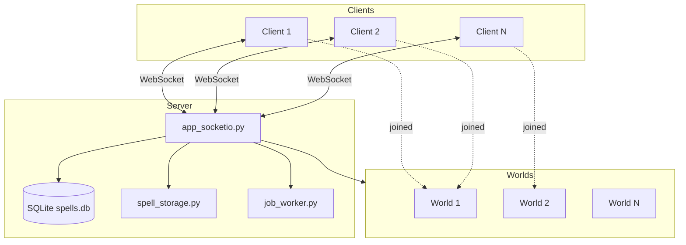
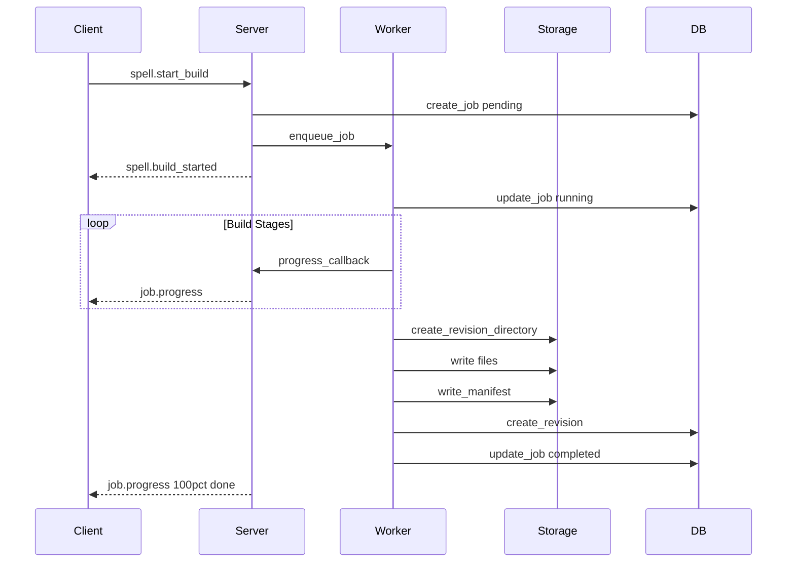

# UGC World Backend

A Flask + Socket.IO server for the Player Created World spell system.

## Features

- **Multi-World Architecture**: A single server can host multiple independent worlds
- **World Management**: Create, list, and join different worlds
- **Spell Package System**: Create, build, and distribute versioned spell packages
- **Build Pipeline**: Background job worker for iterative spell creation
- **Hot-Loading Support**: Clients can download and use new spells without restart
- **Multiplayer Sync**: Deterministic spell execution across all clients in a world
- **Legacy Voxel Ops**: Backward-compatible world operations (add/subtract spheres)

## Quick Start

### 1. Install dependencies

```bash
cd ugc_backend
pip install -r requirements.txt
```

### 2. Run the server

```bash
python app_socketio.py
```

The server will start on ws://0.0.0.0:5000.

## Architecture



### Multi-World Architecture

A single server can host multiple independent worlds:

1. **Client Connection Flow**:
   - Client connects to server via WebSocket
   - Client receives `world.list` to see available worlds
   - Client creates a new world or joins an existing one
   - After joining, client receives world-specific state sync

2. **World Isolation**:
   - Each world has its own operation log (voxel ops)
   - Spell casts are broadcast only to clients in the same world
   - Clients can leave and join different worlds

3. **Shared Resources**:
   - Spells are global (available in all worlds)
   - Build jobs are server-wide

## File Structure

```
ugc_backend/
    app_socketio.py      # Main Socket.IO server
    database.py          # SQLite database for spell metadata
    spell_storage.py     # File system storage for spell packages
    job_worker.py        # Background build job processor
    requirements.txt     # Python dependencies
    fly.toml             # Fly.io deployment config
    Dockerfile           # Docker container config
    data/                # Generated at runtime
        spells.db        # SQLite database
        spells/          # Spell revision files
        blobs/           # Content-addressed blob storage
```

## Socket.IO Events

### Connection Events

| Event | Direction | Description |
|-------|-----------|-------------|
| connect | Client to Server | Client connects |
| disconnect | Client to Server | Client disconnects |
| connected | Server to Client | Connection acknowledged with client_id |

### World Management

| Event | Direction | Data |
|-------|-----------|------|
| world.list | C to S | empty |
| world.list_result | S to C | worlds array |
| world.create | C to S | name, description optional |
| world.created | S to C | world object |
| world.list_updated | S to C broadcast | worlds array (when a world is created) |
| world.join | C to S | world_id |
| world.joined | S to C | world_id, world object |
| world.leave | C to S | empty |
| world.left | S to C | left_world_id |
| world.get | C to S | world_id |
| world.info | S to C | world object |

After joining a world, clients receive `sync_ops` or `sync_complete` with world-specific state.

### Spell Management

| Event | Direction | Data |
|-------|-----------|------|
| spell.create_draft | C to S | spell_id optional |
| spell.draft_created | S to C | spell_id, created, spell |
| spell.start_build | C to S | spell_id, prompt, code, options |
| spell.build_started | S to C | job_id, spell_id |
| spell.publish | C to S | spell_id, revision_id, channel |
| spell.active_update | S to C broadcast | spell_id, revision_id, channel, manifest |
| spell.revision_ready | S to C broadcast | spell_id, revision_id, manifest |
| spell.list | C to S | empty |
| spell.list_result | S to C | spells array |
| spell.get_revisions | C to S | spell_id |
| spell.revisions_result | S to C | spell_id, revisions array |

### Build Jobs

| Event | Direction | Data |
|-------|-----------|------|
| job.progress | S to C | job_id, stage, pct, message, extras |

Stages: prepare, assemble_package, validate, finalize, done

### Content Distribution

| Event | Direction | Data |
|-------|-----------|------|
| content.get_manifest | C to S | spell_id, revision_id |
| content.manifest | S to C | spell_id, revision_id, manifest |
| content.get_file | C to S | spell_id, revision_id, path |
| content.file | S to C | spell_id, revision_id, path, content base64, size |
| content.list_files | C to S | spell_id, revision_id |
| content.files_list | S to C | spell_id, revision_id, files array |

### Spell Casting

| Event | Direction | Data |
|-------|-----------|------|
| spell.cast_request | C to S | spell_id, revision_id, cast_params |
| spell.cast_event | S to C broadcast | spell_id, revision_id, caster_id, cast_params, seed, timestamp |
| spell.cast_rejected | S to C | spell_id, error |

### Legacy World Ops

These events are world-specific. Client must join a world first.

| Event | Direction | Data |
|-------|-----------|------|
| request_spell | C to S | spell object with type, center, radius |
| apply_op | S to C (world room) | op object |
| sync_ops | S to C | ops array on world join |
| sync_complete | S to C | message |
| clear_world | C to S | empty |
| world_cleared | S to C (world room) | world_id |
| ping | C to S | empty |
| pong | S to C | clients count, world_id, ops count |

## HTTP Endpoints

| Endpoint | Method | Description |
|----------|--------|-------------|
| /api/health | GET | Health check |
| /api/spells | GET | List all spells |
| /api/spells/SPELL_ID/revisions/REV_ID/files/PATH | GET | Download file |

## Database Schema

```sql
-- Worlds hosted by this server
CREATE TABLE worlds (
    world_id TEXT PRIMARY KEY,
    name TEXT NOT NULL,
    description TEXT,
    created_by TEXT,
    player_count INTEGER DEFAULT 0,
    created_at TEXT NOT NULL,
    updated_at TEXT NOT NULL
);

-- World-specific operations (voxel ops, etc.)
CREATE TABLE world_ops (
    op_id INTEGER PRIMARY KEY AUTOINCREMENT,
    world_id TEXT NOT NULL,
    op_type TEXT NOT NULL,
    op_data TEXT NOT NULL,
    created_at TEXT NOT NULL,
    FOREIGN KEY (world_id) REFERENCES worlds(world_id) ON DELETE CASCADE
);

-- Spells are global (shared across all worlds)
CREATE TABLE spells (
    spell_id TEXT PRIMARY KEY,
    display_name TEXT,
    active_draft_rev TEXT,
    active_beta_rev TEXT,
    active_stable_rev TEXT,
    created_at TEXT NOT NULL,
    updated_at TEXT NOT NULL
);

CREATE TABLE revisions (
    revision_id TEXT PRIMARY KEY,
    spell_id TEXT NOT NULL,
    parent_revision_id TEXT,
    channel TEXT NOT NULL DEFAULT draft,
    version INTEGER NOT NULL DEFAULT 1,
    manifest_json TEXT NOT NULL,
    created_at TEXT NOT NULL
);

CREATE TABLE jobs (
    job_id TEXT PRIMARY KEY,
    spell_id TEXT NOT NULL,
    draft_id TEXT,
    status TEXT NOT NULL DEFAULT pending,
    stage TEXT,
    progress_pct INTEGER DEFAULT 0,
    logs TEXT,
    error_message TEXT,
    result_revision_id TEXT,
    created_at TEXT NOT NULL,
    updated_at TEXT NOT NULL
);
```

## Build Job Flow



## Environment Variables

| Variable | Default | Description |
|----------|---------|-------------|
| HOST | 0.0.0.0 | Server bind address |
| PORT | 5000 | Server port |
| SECRET_KEY | dev-secret-key | Flask secret key |

## Development

### Testing with Multiple Clients

1. Start the server
2. Open multiple Godot instances
3. Connect all to the same server
4. Build/publish spells from one client
5. All clients receive updates and can cast immediately

### Creating a Spell Programmatically

```python
from database import init_database, create_spell, create_revision
from database import update_spell_active_revision
from spell_storage import create_revision_directory, write_revision_file_text
from spell_storage import write_manifest, create_manifest

# Initialize
init_database()

# Create spell
spell_id = "my_fireball"
create_spell(spell_id, "My Fireball")

# Create revision
revision_id = "rev_000001"
create_revision_directory(spell_id, revision_id)

# Write spell code
code = """extends SpellModule

func on_cast(ctx: SpellContext) -> void:
    print("Fireball!")
    ctx.world.play_vfx("fire", ctx.target_position, {})
"""
code_info = write_revision_file_text(spell_id, revision_id, "code/spell.gd", code)

# Write manifest
manifest = create_manifest(
    spell_id=spell_id,
    revision_id=revision_id,
    version=1,
    code_files=[code_info]
)
write_manifest(spell_id, revision_id, manifest)

# Register and publish
create_revision(revision_id, spell_id, manifest, "beta", 1)
update_spell_active_revision(spell_id, "beta", revision_id)
```

## Deployment

### Fly.io

```bash
fly auth login
fly deploy
fly logs
```

Configuration in fly.toml:
- App name: ugc-world-backend
- Region: sjc San Jose
- Internal port: 5000

### Docker

```bash
docker build -t ugc-backend .
docker run -p 5000:5000 ugc-backend
```

## See Also

- Spell System Documentation: player-created-world/docs/SPELLS.md
- Architecture Overview: player-created-world/docs/ARCHITECTURE.md
- Spell Cost Specification: docs/SpellCost.md
